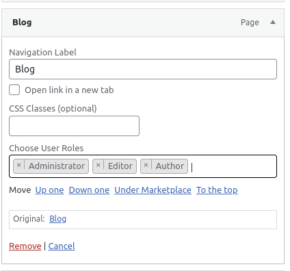

# menu-by-user-roles

Welcome to the official GitHub repository for "Menu By User Roles," the ultimate WordPress plugin for custom menu management based on user roles.

## Features

- Assign user roles to individual menu items.
- Define custom user roles through WordPress.
- Control menu visibility based on user authentication status.
- Flexible options for displaying menu items to different user groups.

## Latest Release

## Installation

1. Download the plugin as a ZIP file.
2. Log in to your WordPress admin panel.
3. Navigate to `Plugins` > `Add New`.
4. Click the `Upload Plugin` button and select the ZIP file you downloaded.
5. Activate the plugin.

## Usage

1. After activating the plugin, go to the `Appearance` > `Menus` section in your WordPress dashboard.
2. Edit a menu item and you will find a new option to assign user roles.
3. Choose the desired user roles for the menu item.
4. Save the menu.

## Screenshots

_*Here is an example of a menu item with user role selection options.*_

## Contributing

Contributions are welcome! Feel free to open an issue or submit a pull request.

## License

This project is licensed under the [MIT License](https://opensource.org/licenses/MIT).

## Author

[Kahnu Charan Swain](https://github.com/kahnu044)
